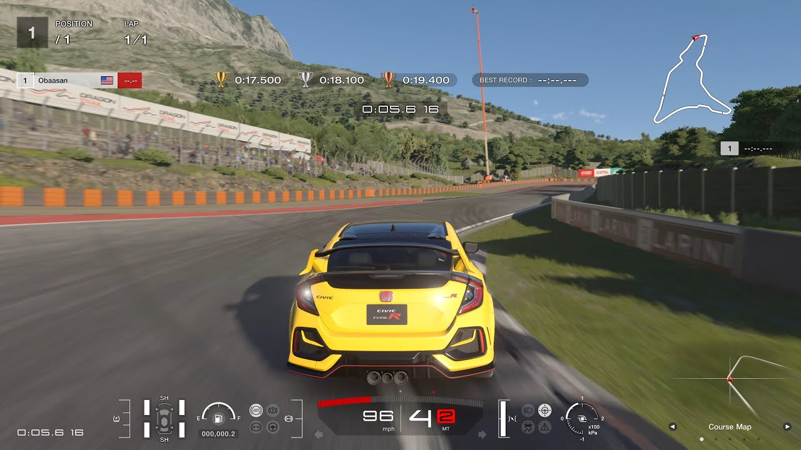

# The Future of Racing Games 

## Introduction
Racing games, over the past decade have been disappointing to say the least. They haven't neccessarily been all bad games, just not very good ones. Compare that to the golden era from the 2000s and early 2010s and some might say that I've been hooked on nostalgia. I ask those people to look at the following images.

Notice anything about the above two images? They're both simple track racers! Now don't get me wrong I love playing GT7 and the asseto corsa mod that lets you play No Hesi, brings fantasy to reality. But a majority of many racing games released these days are just track racers. Even if you consider a game like the Crew Motorfest, which (fwiw) has improved in trying to bring a certain style to the game, they all for the most part, feel very corporate and same-y aside from their handling models and which cars they did or didn't get the license too.

What the games of the early days had was not graphics, realism, easy to maneuver UI, or anything like that. Perfect corporate style guides were never invented, logos didn't have to be 2D and flat, instead make whatever you want, add spikes and spray paint, dabble in explosions, do anything you want because in those games - personalitly was allowed to shine.

That is what I hope to achieve in the new racing game I'm making, coming out next year >:)

